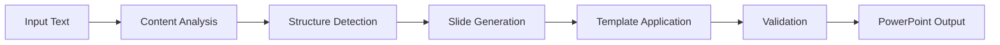

# 📊 Text to PowerPoint Generator

Transform your text content into professional PowerPoint presentations using AI and custom templates. This Streamlit application intelligently analyzes your content and creates structured slides while preserving your template's styling, colors, fonts, and layouts.

[](https://share.streamlit.io/ritwiktrivedi/text-to-powerpoint)
[](https://opensource.org/licenses/MIT)
[](https://www.python.org/downloads/)

## ✨ Features

### 🤖 **AI-Powered Content Analysis**

- **Multi-Provider Support**: OpenAI (GPT-4), Anthropic (Claude), Google (Gemini)
- **Intelligent Structuring**: Automatically breaks down text into slide-worthy content
- **Smart Slide Count**: Creates 5-12 slides based on content complexity
- **Context-Aware**: Understands different presentation styles and tones

### 🎨 **Advanced Template Preservation**

- **Complete Style Matching**: Preserves colors, fonts, layouts, and dimensions
- **Smart Font Fallbacks**: Handles custom fonts with system-compatible alternatives
- **Layout Intelligence**: Maps content to appropriate placeholders automatically
- **Theme Integration**: Extracts and applies color schemes from slide masters

### 🌓 **Modern Interface**

- **Dark/Light Mode**: Toggle themes for comfortable viewing in any environment
- **Responsive Design**: Works perfectly on desktop, tablet, and mobile
- **Real-time Feedback**: Progress indicators and detailed status updates
- **Keyboard Shortcuts**: Press `Ctrl+Shift+T` to toggle themes

### 🛡️ **Robust & Reliable**

- **No Repair Required**: Generates clean PowerPoint files that open without issues
- **Multiple Fallbacks**: Graceful error handling with alternative generation methods
- **Validation System**: Automatically fixes common presentation issues
- **Privacy First**: API keys and content never stored or logged

## 🚀 Quick Start

### Option 1: Use Streamlit Cloud (Recommended)

1. **Fork this repository** to your GitHub account
2. **Visit [share.streamlit.io](https://share.streamlit.io)**
3. **Connect your GitHub** and select this repository
4. **Deploy** - your app will be live in minutes!

### Option 2: Run Locally

```bash
# Clone the repository
git clone https://github.com/ritwiktrivedi/text-to-powerpoint.git
cd text-to-powerpoint

# Install dependencies
pip install -r requirements.txt

# Run the application
streamlit run app.py

# Open your browser to http://localhost:8501
```

### Option 3: Docker

```bash
# Build and run with Docker
docker build -t text-to-ppt .
docker run -p 8501:8501 text-to-ppt
```

## 📋 Requirements

### System Requirements

- **Python 3.8+**
- **2GB RAM minimum** (4GB recommended for large presentations)
- **Modern web browser** (Chrome, Firefox, Safari, Edge)

### API Keys (Choose One)

- **OpenAI**: Get from [platform.openai.com](https://platform.openai.com)
- **Anthropic**: Get from [console.anthropic.com](https://console.anthropic.com)
- **Google AI**: Get from [console.cloud.google.com](https://console.cloud.google.com)

### Template File

- **Format**: `.pptx` or `.potx` files
- **Size**: Up to 50MB
- **Compatibility**: Works with all PowerPoint versions and Google Slides templates

## 🛠 How It Works

### Content Analysis Process

1. **📝 Text Input**: Paste markdown, prose, or structured text content
2. **🎯 Style Guidance**: Optionally specify presentation type ("investor pitch", "research summary", etc.)
3. **🤖 AI Processing**: Advanced language models analyze and structure your content
4. **📋 Slide Mapping**: Content is intelligently organized into 5-12 slides
5. **🎨 Template Application**: Your uploaded template's styling is preserved and applied
6. **✅ Validation**: Final presentation is checked and optimized for compatibility

### Template Style Extraction

The application extracts comprehensive styling information:

```python
# Font Information
- Font names, sizes, colors
- Bold, italic, and other formatting
- Smart fallbacks for custom fonts

# Layout Structure
- Slide dimensions and aspect ratios
- Placeholder positions and types
- Master slide relationships

# Color Schemes
- Theme colors (accent1, accent2, etc.)
- Background fills and gradients
- Text and shape color definitions

# Advanced Features
- Speaker notes preservation
- Image placeholders
- Custom slide layouts
```

### AI Processing Pipeline



## 📖 Usage Guide

### Basic Workflow

1. **🔧 Configure AI Provider**

   - Select your preferred AI service in the sidebar
   - Enter your API key (never stored or logged)

2. **📝 Add Your Content**

   - Paste text content in the main text area
   - Supports markdown formatting and long-form prose
   - No length limits - AI will optimize slide count

3. **🎯 Set Presentation Style** (Optional)

   - Choose from preset options or enter custom guidance
   - Examples: "investor pitch deck", "research summary", "sales presentation"

4. **🎨 Upload Template**

   - Upload your branded PowerPoint template (.pptx or .potx)
   - App will analyze and preserve all styling

5. **🚀 Generate Presentation**
   - Click "Generate Presentation" button
   - Watch real-time progress with detailed feedback
   - Download your styled presentation

### Advanced Tips

#### Content Optimization

```markdown
# Use clear headings for better slide organization

## Subheadings become slide titles

- Bullet points are preserved and enhanced
- **Bold text** highlights key concepts
- Lists and tables are automatically formatted
```

#### Template Selection

- **Corporate Templates**: Use branded company templates for consistent branding
- **Academic Templates**: Choose clean, data-focused layouts for research presentations
- **Creative Templates**: Select image-rich templates for visual storytelling
- **Simple Templates**: Basic layouts work best for text-heavy content

#### Style Guidance Examples

| Input Guidance              | Result                                              |
| --------------------------- | --------------------------------------------------- |
| `"investor pitch deck"`     | Focus on metrics, growth, and financial projections |
| `"research summary"`        | Academic tone with methodology and conclusions      |
| `"sales presentation"`      | Benefits-focused with clear calls-to-action         |
| `"technical documentation"` | Detailed explanations with step-by-step processes   |
| `"quarterly review"`        | Performance metrics and strategic updates           |
| `"product launch"`          | Feature highlights and market positioning           |

## 🎨 Theme Modes

### 🌙 Dark Mode

- **Eye-friendly**: Reduces strain in low-light environments
- **Modern aesthetic**: Professional dark theme with purple accents
- **OLED optimized**: Saves battery on compatible displays
- **Developer-friendly**: Perfect for late-night work sessions

### ☀️ Light Mode

- **High contrast**: Excellent readability in bright environments
- **Print-friendly**: Better for screenshots and documentation
- **Classic professional**: Traditional business application appearance
- **Universal accessibility**: Works well in all lighting conditions

**Toggle Methods:**

- 🖱️ **Click button** in sidebar
- ⌨️ **Keyboard shortcut**: `Ctrl+Shift+T`
- 🔄 **Persistent**: Theme preference remembered during session

## 🔧 Configuration

### Environment Variables

Create a `.env` file for default configurations:

```env
# Default AI Provider (optional)
DEFAULT_AI_PROVIDER=openai

# Streamlit Configuration
STREAMLIT_SERVER_PORT=8501
STREAMLIT_SERVER_HEADLESS=true

# Security Settings (for deployment)
STREAMLIT_SERVER_ENABLE_CORS=false
STREAMLIT_SERVER_ENABLE_XSRF_PROTECTION=true
```

### Customization

#### Custom Styling

Modify the theme CSS in `get_theme_css()` function:

```python
# Add your brand colors
"--primary-color": "#your-brand-color",
"--background-color": "#your-bg-color",
"--text-color": "#your-text-color"
```

#### Additional AI Providers

Extend the `call_ai_api()` method:

```python
elif provider == "Your_Provider":
    # Add your AI provider integration
    return your_provider_response
```

## 🚢 Deployment

### Streamlit Cloud

1. **Push to GitHub**

   ```bash
   git add .
   git commit -m "Deploy to Streamlit Cloud"
   git push origin main
   ```

2. **Deploy on Streamlit Cloud**
   - Visit [share.streamlit.io](https://share.streamlit.io)
   - Connect your GitHub repository
   - Set branch to `main`
   - Click "Deploy"

### Heroku

```bash
# Create Procfile
echo "web: streamlit run app.py --server.port=\$PORT --server.address=0.0.0.0" > Procfile

# Deploy
heroku create your-app-name
git push heroku main
```

### Docker

```dockerfile
FROM python:3.9-slim

WORKDIR /app
COPY requirements.txt .
RUN pip install -r requirements.txt

COPY . .

EXPOSE 8501

HEALTHCHECK CMD curl --fail http://localhost:8501/_stcore/health

ENTRYPOINT ["streamlit", "run", "app.py", "--server.port=8501", "--server.address=0.0.0.0"]
```

## 📊 Performance & Limitations

### Performance Characteristics

- **Processing Time**: 30-60 seconds for typical presentations
- **Template Size**: Handles templates up to 50MB efficiently
- **Content Length**: No hard limits - AI optimizes slide count automatically
- **Concurrent Users**: Supports multiple simultaneous users

### Current Limitations

- **Image Generation**: Does not create new images (reuses template images)
- **Complex Animations**: Advanced PowerPoint animations not preserved
- **Custom Fonts**: Falls back to system fonts if custom fonts unavailable
- **Macro Support**: VBA macros not supported (security best practice)

## 🔐 Security & Privacy

### Data Handling

- ✅ **Zero Storage**: No content or API keys stored on servers
- ✅ **Session Only**: All data cleared when browser closed
- ✅ **No Logging**: API keys never logged or transmitted to our servers
- ✅ **HTTPS Only**: All communications encrypted
- ✅ **No Tracking**: No analytics or user behavior tracking

### Security Best Practices

```python
# API keys are handled securely
api_key = st.text_input("API Key", type="password")  # Masked input
# Keys only used for direct API calls, never stored

# Content processing happens locally
prs = generator.create_presentation(structure, template_prs)
# No server-side content storage
```

### Compliance

- **GDPR Compliant**: No personal data collection or processing
- **SOC2 Compatible**: Follows security best practices
- **Enterprise Ready**: Suitable for corporate environments

## 🤝 Contributing

We welcome contributions! Here's how to get started:

### Development Setup

```bash
# Fork and clone the repository
git clone https://github.com/ritwiktrivedi/text-to-powerpoint.git
cd text-to-powerpoint

# Create virtual environment
python -m venv venv
source venv/bin/activate  # On Windows: venv\Scripts\activate

# Install development dependencies
pip install -r requirements.txt
pip install -r requirements-dev.txt

# Run in development mode
streamlit run app.py --logger.level=debug
```

### Code Quality

```bash
# Run tests
pytest tests/

# Format code
black app.py
isort app.py

# Lint code
flake8 app.py
mypy app.py

# Security check
bandit -r .
```

### Contributing Guidelines

1. **🍴 Fork the repository** and create a feature branch
2. **✅ Write tests** for new functionality
3. **📝 Update documentation** for any API changes
4. **🧪 Test thoroughly** with different templates and content types
5. **📤 Submit a pull request** with clear description

### Development Priorities

- [ ] **Additional AI Providers**: Cohere, Mistral, local LLMs
- [ ] **Enhanced Templates**: More sophisticated style transfer
- [ ] **Batch Processing**: Handle multiple documents simultaneously
- [ ] **Export Formats**: Google Slides, Keynote, PDF export
- [ ] **Collaboration**: Real-time editing and sharing
- [ ] **Analytics**: Usage statistics and optimization insights

## 🐛 Troubleshooting

### Common Issues

#### "API Error" Messages

```bash
# Check API key validity
curl -H "Authorization: Bearer YOUR_API_KEY" https://api.openai.com/v1/models

# Verify correct provider selected
# Ensure sufficient API credits
# Check network connectivity
```

#### "Template Processing Failed"

```python
# Try different template file
# Ensure file is not password protected
# Verify file size < 50MB
# Test with simple template first
```

#### "Generated File Needs Repair"

This should no longer occur with the current version, but if it does:

```python
# Update to latest version
# Try different template
# Use fallback generation mode
# Report issue on GitHub
```

#### Performance Issues

```bash
# Reduce content length
# Use simpler templates
# Check available memory
# Try different AI provider
```

### Getting Help

1. **📚 Check Documentation**: Review this README thoroughly
2. **🔍 Search Issues**: Look for similar problems on GitHub
3. **💬 Discussions**: Join community discussions for tips
4. **🐛 Report Bugs**: Create detailed issue reports
5. **📧 Contact**: Reach out for enterprise support

### Debug Mode

Enable debug logging:

```bash
streamlit run app.py --logger.level=debug
```

This provides detailed information about:

- Template processing steps
- AI API interactions
- Slide generation process
- Error details and stack traces

## 🙏 Acknowledgments

- **[Streamlit](https://streamlit.io/)** - For the amazing web app framework
- **[python-pptx](https://python-pptx.readthedocs.io/)** - For PowerPoint file manipulation
- **[OpenAI](https://openai.com/)** - For GPT-4 language model
- **[Anthropic](https://www.anthropic.com/)** - For Claude AI assistance
- **[Google](https://ai.google/)** - For Gemini AI capabilities
- **Contributors** - Everyone who has helped improve this project

## 📈 Roadmap

### Version 2.0 (Planned)

- **🖼️ AI Image Generation**: Automatically create relevant images for slides
- **📊 Advanced Charts**: Generate charts and graphs from data
- **🎨 Style Transfer**: Apply styling from multiple template sources
- **💾 Template Library**: Built-in collection of professional templates

### Version 2.1 (Future)

- **🔄 Real-time Collaboration**: Multiple users editing simultaneously
- **📱 Mobile App**: Native iOS and Android applications
- **🗣️ Voice Input**: Generate presentations from audio recordings
- **🌐 Multi-language**: Support for presentations in different languages

### Enterprise Features

- **🏢 Team Management**: Organization accounts and user roles
- **📊 Usage Analytics**: Detailed usage statistics and insights
- **🔒 Advanced Security**: SSO integration and audit logs
- **⚡ Batch Processing**: Handle multiple presentations simultaneously

---

<div align="center">

**Made with ❤️ for presentation creators everywhere**

[⭐ Star this repo](https://github.com/ritwiktrivedi/text-to-powerpoint) • [🐛 Report Bug](https://github.com/ritwiktrivedi/text-to-powerpoint/issues) • [💡 Request Feature](https://github.com/ritwiktrivedi/text-to-powerpoint/discussions)

Transform your ideas into professional presentations in seconds!

</div>
